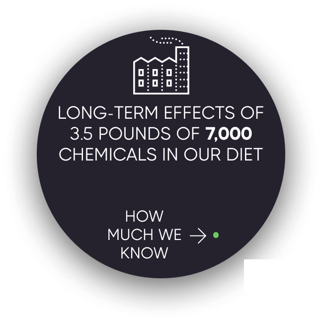
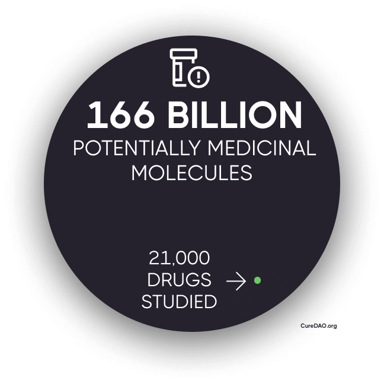
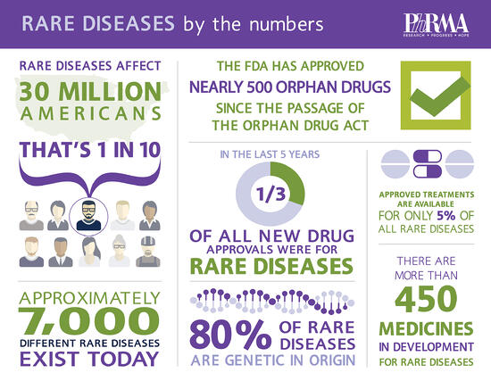
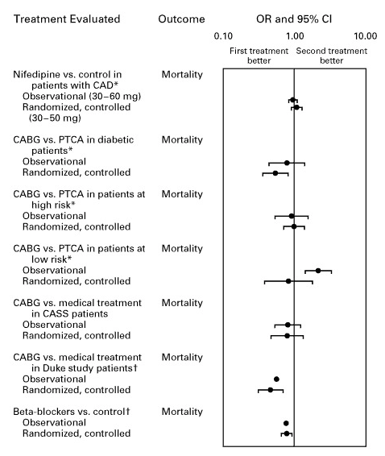
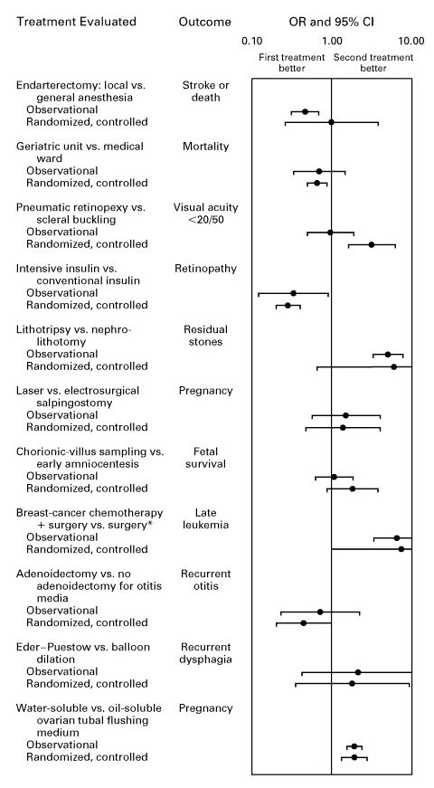
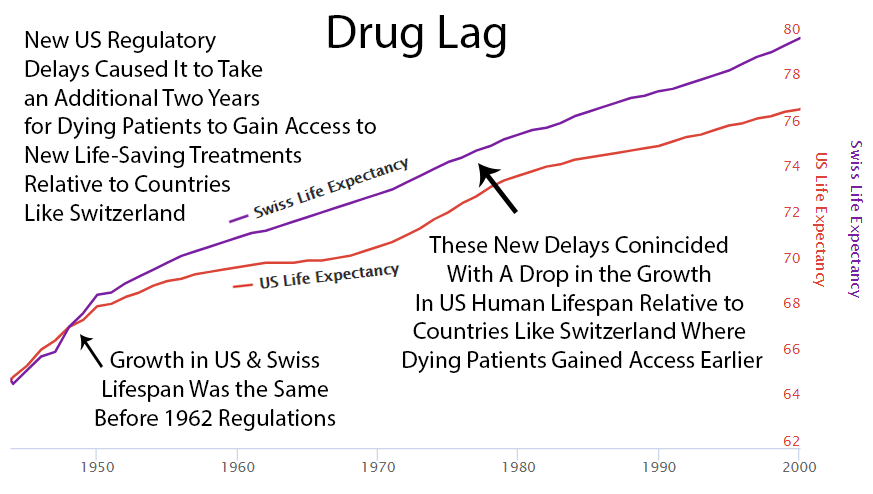
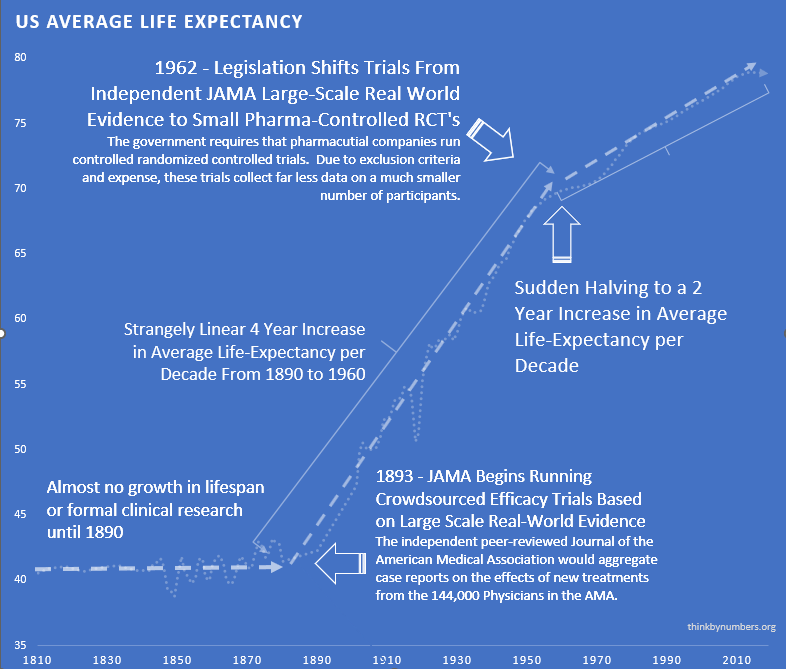

# 💡 The Decentralized FDA DAO

## 💡The Problem

#### :skull\_crossbones: You and Everyone You Love Will Suffer and Die

Over [2 billion](https://www.george-health.com/global-health-challenge/) people are suffering and [150,000](https://www.weforum.org/agenda/2020/05/how-many-people-die-each-day-covid-19-coronavirus/) people die every single day from preventable diseases. For perspective, this is equivalent to:

* [**FIFTY-ONE**](https://en.wikipedia.org/wiki/Casualties\_of\_the\_September\_11\_attacks) September 11th attacks every day
* [**NINE**](https://www.haaretz.com/israel-news/6-million-where-is-the-figure-from-1.10570907) Holocausts every year

Unfortunately, the congressional mandate of the US Food and Drug Administration makes it impossible to efficiently solve this problem.

### The US FDA’s Mandate is Not to Maximize Lives Saved

Reducing disease and increasing longevity is not the congressional mandate of the FDA. Its mandate is to ensure the “ **safety and efficacy of drugs and medical devices** “. The only way to perfectly fulfill this mandate is drive the regulatory financial barrier to a new treatments to infinity. That would 100% guarantee that an unsafe or ineffective drug ever gets on the market again. The massive explosion in the cost of drug development is the logical consequence of this mandate.

A mandate preferable to the [60 million](https://www.theworldcounts.com/populations/world/deaths) people that die every year and the [2.5 billion](https://www.ncbi.nlm.nih.gov/pmc/articles/PMC6214883/) people suffering from chronic diseases would be to **maximize the average healthy human lifespan** .

## Hypotheses

1. Given clear and optimized mandate, the crowd wisdom of a large body of medical experts can produce policies that are more effective at extending healthy human lifespan than the current regulatory framework.
2. It is possible to implement such a regulatory body in an micro-state or economic zone such as Prospera, a semi-autonomous jurisdiction on Honduras.
3. Evidence of the success of this model will make it possible to promote adoption by other micro-nations.
4. Evidence of the success of this model will make it possible to promote adoption by increasingly larger states.

## A Futarchy-Based Meritocratic Regulatory Framework

Medical experts will receive soul-bound non-transferable deFDA Credential NFTs (FDA-CRED) will be issued to all members of the American Medical Association (AMA) and other international bodies which verify medical credentialing.

One deFDA fungible Reputation Token (FDA-REP) will be airdropped to holder of FDA-NFTs for each intervention that is proposed for a specified population.

Medical experts can stake their token in one of three pools based on their belief for the experimental population relative to those outside the regulatory jurisdiction:

1. "Uncertain Pool" - they are uncertain of the outcome of the reform
2. "Harmful Pool" - reform will result in a relative net average DECREASE in healthspan
3. "Helpful Pool" - reform will result in a relative net average INCREASE in healthspan

If they do nothing, it will be assumed that they did not review the proposal.

If the "Helpful Pool" is the majority, the proposal will be approved and implemented. Post-marketing pharmacovigilence data will be collected from the participants and used to determine the relative change in healthspan between affected and unaffected populations.

#### Problems that Could be Solved with a New Regulatory Framework

It takes over [10 years and $2.6 billion](https://www.semanticscholar.org/paper/Innovation-in-the-pharmaceutical-industry%3A-New-of-DiMasiGrabowski/3275f31c072ac11c6ca7a5260bd535720f07df41) to bring a drug to market (including failed attempts). It costs [$41k](https://www.clinicalleader.com/doc/getting-a-handle-on-clinical-trial-costs-0001) per subject in Phase III clinical trials.

The high costs lead to:

**1. No Data on Unpatentable Molecules**

We still know next to nothing about the long-term effects of 99.9% of the 4 pounds of over [7,000](https://www.dailymail.co.uk/health/article-8757191/Are-additives-food-making-ill.html) different synthetic or natural compounds. This is because there's only sufficient incentive to research patentable molecules.

**2. Lack of Incentive to Discover Every Application of Off-Patent Treatments**

Most of the known diseases (approximately 95%) are classified as rare diseases. Currently, a pharmaceutical company must predict particular conditions to treat before running a clinical trial. Suppose a drug is effective for other diseases after the patent expires. In that case, there isn't a financial incentive to get it approved for the different conditions.

**3. No Long-Term Outcome Data**

It's not financially feasible to collect a participant's data for years or decades. Thus, we don't know if the long-term effects of a drug are worse than the initial benefits.

**4. Negative Results Aren't Published**

Pharmaceutical companies tend to only report "positive" results. That leads to other companies wasting money repeating research on the same dead ends.

**5. Trials Exclude a Vast Majority of The Population**

One investigation found that only [14.5%](https://www.ncbi.nlm.nih.gov/pubmed/14628985) of patients with major depressive disorder fulfilled eligibility requirements for enrollment in an antidepressant trial. Furthermore, most patient sample sizes are very small and sometimes include only 20 people.

**6. We Only Know 0.000000002% of What is Left to be Researched**

The more research studies we read, the more we realize we don't know. Nearly every study ends with the phrase "more research is needed".

If you multiply the [166 billion](https://www.nature.com/articles/549445a) molecules with drug-like properties by the [10,000](https://www.washingtonpost.com/news/fact-checker/wp/2016/11/17/are-there-really-10000-diseases-and-500-cures/) known diseases, that's 1,162,000,000,000,000 combinations. So far, we've studied [21,000 compounds](https://www.centerwatch.com/articles/12702-new-mit-study-puts-clinical-research-success-rate-at-14-percent). That means we only know 0.000000002% of the effects left to be discovered.

#### How a DAO Regulatory Body Could Overcome Perverse Incentives

**Overcoming Cognitive Bias Against Acts of Commission**

Humans have a cognitive bias towards weighting harmful acts of commission to be worse than acts of omission even if the act of omission causes greater harm. It's seen in the trolley problem where people generally aren't willing to push a fat man in front of a train to save a family even though more lives would be saved.

Medical researcher Dr. Henry I. Miller, MS, MD described his experience working at the FDA, “In the early 1980s,” Miller wrote, “when I headed the team at the FDA that was reviewing the NDA \[application] for recombinant human insulin…my supervisor refused to sign off on the approval,” despite ample evidence of the drug’s ability to safely and effectively treat patients. His supervisor rationally concluded that, if there was a death or complication due to the medication, heads would roll at the FDA—including his own. So the personal risk of approving a drug is magnitudes larger than the risk of rejecting it.

In a DAO comprised of a large number of prominent experts, no individual could be blamed or have their career destroyed for making a correct decision to save the invisible lives of the many at the risk of the lives of the few.

**It's Impossible to Report on Deaths That Occurred Due to Unavailable Treatments**

Here's a news story from the Non-Existent Times by No One Ever without a picture of all the people that die from lack of access to life-saving treatments that might have been.

This means that it's only logical for regulators to reject drug applications by default. The personal risks of approving a drug with any newsworthy side effect far outweigh the personal risk preventing access to life-saving treatment.

**Types of Error in FDA Approval Decision**

|                             | Drug Is Beneficial                                       | Drug Is Harmful                                                |
| --------------------------- | -------------------------------------------------------- | -------------------------------------------------------------- |
| FDA Allows the Drug         | Correct Decision                                         | 
 Victims are identifiable and might appear on Oprah.
 |
| FDA Does Not Allow the Drug | 
Victims are not identifiable or acknowledged. 
 | Correct Decision                                               |

#### Current Regulation Expects Drug Developers to Have Psychic Powers

When running an efficacy trial, the FDA expects that the drug developer has the psychic ability to predict which conditions a treatment will be most effective for in advance of collecting the human trial data. If it was possible to magically determine this without any trials, it would render efficacy trials completely pointless.

In 2007, manufacturer Dendreon submitted powerful evidence attesting to the safety and efficacy of its immunotherapy drug Provenge, which targets prostate cancer. They were able to show that the drug resulted in a significant decline in deaths among its study population, which even persuaded the FDA advisory committee to weigh in on the application. But ultimately, the FDA rejected its application.

The FDA was unmoved by the evidence, simply because Dendreon didn’t properly specify beforehand what its study was trying to measure. Efficacy regulations state that finding a decline in deaths is not enough. The mountains of paperwork must be filled out just so and in the correct order. It took three more years and yet another large trial before the FDA finally approved the life-saving medication.

Due to all the additional costs imposed by the efficacy trial burden, Dendreon ultimately [filed for chapter 11 bankruptcy](https://www.targetedonc.com/view/dendreon-files-for-bankruptcy-provenge-still-available).

In addition to the direct costs to companies, the extreme costs and financial risks imposed by efficacy trials have a huge chilling effect on investment in new drugs. If you're an investment adviser, trying to avoid losing your client's retirement savings, you're much better off investing in a more stable company like a bomb manufacturer building products to intentionally kill people than a drug developer trying to save lives. So it's impossible to know all of the treatments that never even got to an efficacy trial stage due to the effects of decreased investment due to the regulatory risks.

### What We Don't Know

We’re only 2 lifetimes from the use of the modern scientific method in medicine. Thus it's only been applied for 0.0001% of human history. The more clinical research studies we read, the more we realize we don’t know. Nearly every study ends with the phrase "more research is needed". We know basically nothing at this point compared to what will eventually be known about the human body.

There are over [7,000](https://www.washingtonpost.com/news/fact-checker/wp/2016/11/17/are-there-really-10000-diseases-and-500-cures/) known diseases afflicting humans.

There are as many untested compounds with drug-like properties as there are [atoms in the solar system](https://www.nature.com/articles/549445a) (166 billion).

.png>)

If you multiply the number of molecules with drug-like properties by the number of diseases, that's 1,162,000,000, 000,000 combinations. So far we've studied [21,000 compounds](https://www.centerwatch.com/articles/12702-new-mit-study-puts-clinical-research-success-rate-at-14-percent).

That means we only know 0.000000002% of what is left to be known.

 (5).png>)

The currently highly restrictive overly cautious method of clinical research prevents us from knowing more faster.

We’re at the very beginning of thousands or millions of years of systematic discovery. So it’s unlikely that this decline in lifespan growth is the result of diminishing returns due to our running out of things to discover.

However, to validate the theory that large-scale real-world evidence can produce better health outcomes requires further validation of this method of experimentation. That's the purpose of deFDA.

**Cost Savings in Drug Development**

Failed drug applications are expensive. A global database of treatments and outcomes could provide information that could avoid massive waste on failed trials.

* A 10% improvement in predicting failure before clinical trials could save [$100 million](https://drugwonks.com/blog/the-dog-days-of-drug-approvals) in development costs.
* Shifting 5% of clinical failures from Phase III to Phase I reduces out-of-pocket costs by [$15 to $20 million](https://drugwonks.com/blog/the-dog-days-of-drug-approvals).
* Shifting failures from Phase II to Phase I would reduce out-of-pocket costs by [$12 to $21 million](https://drugwonks.com/blog/the-dog-days-of-drug-approvals).

**Cost Savings Through Decentralization**

* In phase II studies, the typical decentralized clinical trial (DCT) deployment produced a [400%](https://github.com/cure-dao/docs/blob/main/assets/financial-benefits-of-decentralized-trials.pdf) return on investment in terms of trial cost reductions.
* In phase III studies, decentralization produced a [1300%](https://github.com/cure-dao/docs/blob/main/assets/financial-benefits-of-decentralized-trials.pdf) return on investment.

**Meta-Analyses Support of Real-World Evidence**

Observational real-world evidence-based studies have several advantages over randomized, controlled trials, including lower cost, increased speed of research, and a broader range of patients. However, concern about inherent bias in these studies has limited their use in comparing treatments. Observational studies have been primarily used when randomized, controlled trials would be impossible or unethical.

However, [meta-analyses](https://www.nejm.org/doi/full/10.1056/NEJM200006223422506) found that:

> when applying modern statistical methodologies to observational studies, the results are generally **not quantitatively or qualitatively different** from those obtained in randomized, controlled trials.

**Mortality Observational Studies**

**Observational Studies for Various Outcomes**

**Historical Evidence in Support of Our Hypotheses**

There is compelling historical evidence suggesting that large scale efficacy-trials based on real-world evidence have ultimately led to better health outcomes than current pharmaceutical industry-driven randomized controlled trials.

For over 99% of recorded human history, the average human life expectancy has been around 30 years.

**1893 - The Advent of Safety and Efficacy Trials**

In the late nineteenth and early twentieth century, clinical objectivity grew. The independent peer-reviewed Journal of the American Medical Association (JAMA) was founded in 1893. It would gather case reports from the 144,000 physicians members of the AMA on the safety and effectiveness of drugs. The leading experts in the area of a specific medicine would review all of the data and compile them into a study listing side effects and the conditions for which a drug was or was not effective. If a medicine were found to be safe, JAMA would give its seal of approval for the conditions where it was found to be effective.

The adoption of this system of crowd-sourced, observational, objective, and peer-reviewed clinical research was followed by a sudden shift in the growth of human life expectancy. After over 10,000 years of almost no improvement, we suddenly saw a strangely linear 4-year increase in life expectancy every single year.

**1938 - The FDA Requires Phase 1 Safety Trials**

A drug called Elixir sulfanilamide caused over [100 deaths](https://www.fda.gov/files/about%20fda/published/The-Sulfanilamide-Disaster.pdf) in the United States in 1937.

Congress [reacted](https://en.wikipedia.org/wiki/Elixir\_sulfanilamide) to the tragedy by requiring all new drugs to include:

> "adequate tests by all methods reasonably applicable to show whether or not such drug is safe for use under the conditions prescribed, recommended, or suggested in the proposed labeling thereof."

These requirements evolved to what is now called the [Phase 1 Safety Trial](https://en.wikipedia.org/wiki/Phase\_1\_safety\_trial).

This consistent four-year/year increase in life expectancy remained unchanged before and after the new safety regulations.

This suggests that the regulations did not have a large-scale positive or negative impact on the development of life-saving interventions.

**1950's - Thalidomide Causes Thousands of Birth Defects Outside US**

Thalidomide was first marketed in Europe in [1957](https://en.wikipedia.org/wiki/Thalidomide) for morning sickness. While it was initially thought to be safe in pregnancy, it resulted in thousands of horrific congenital disabilities.

Fortunately, the existing FDA safety regulations prevented any birth defects in the US. Despite the effectiveness of the existing US regulatory framework in protecting Americans, newspaper stories such as the one below created a strong public outcry for increased regulation.

**1962 - New Efficacy Regulations Reduce the Amount and Quality of Efficacy Data Collected**

As effective **safety** regulations were already in place, the government instead responded to the Thalidomide disaster by regulating **efficacy** testing via the 1962 Kefauver Harris Amendment. Before the 1962 regulations, it cost a drug manufacturer an average of $74 million (2020 inflation-adjusted) to develop and test a new drug for safety before bringing it to market. Once the FDA had approved it as safe, efficacy testing was performed by the third-party American Medical Association. Following the regulation, trials were instead to be conducted in small, highly-controlled trials by the pharmaceutical industry.

**Reduction in Efficacy Data**

The 1962 regulations made these large real-world efficacy trials illegal. Ironically, even though the new regulations were primarily focused on ensuring that drugs were effective through controlled FDA efficacy trials, they massively reduced the quantity and quality of the efficacy data that was collected for several reasons:

* New Trials Were Much Smaller
* Participants Were Less Representative of Actual Patients
* They Were Run by Drug Companies with Conflicts of Interest Instead of the 3rd Party AMA

**Reduction in New Treatments**

The new regulatory clampdown on approvals immediately reduced the production of new treatments by 70%.

**Explosion in Costs**

Since the abandonment of the former efficacy trial model, costs have exploded. Since 1962, the cost of bringing a new treatment to market has gone from [$74 million](https://publications.parliament.uk/pa/cm200405/cmselect/cmhealth/42/4207.htm) to over [$1 billion](https://publications.parliament.uk/pa/cm200405/cmselect/cmhealth/42/4207.htm) US dollars (2020 inflation-adjusted).

**High Cost of Development Favors Monopoly and Punishes Innovation**

There's another problem with the increasing costs of treatment development. In the past, a genius scientist could come up with a treatment, raise a few million dollars, and do safety testing. Now that it costs a billion dollars to get a drug to market, the scientist has to persuade one of a few giant drug companies that can afford it to buy his patent.

Then the drug company has two options:

**Option 1: Risk $1 billion on clinical trials**

**Possibility A:** Drug turns out to be one of the 90% the FDA rejects. GIVE BANKER A BILLION DOLLARS. DO NOT PASS GO.

**Possibility B:** Drug turns out to be one of the 10%, the FDA approves. Now it's time to try to recover that billion dollars. However, very few drug companies have enough money to survive this game. So, this company almost certainly already has an existing inferior drug on the market to treat the same condition. Hence, any profit they make from this drug will likely be subtracted from revenue from other drugs they've already spent a billion dollars on.

**Option 2: Put the patent on the shelf**

Do not take a 90% chance of wasting a billion dollars on failed trials. Do not risk making your already approved cash-cow drugs obsolete.

What's the benefit of bringing better treatment to market if you're just going to lose a billion dollars? Either way, the profit incentive is entirely in favor of just buying better treatments and shelving them.

**Cures Are Far Less Profitable Than Lifetime Treatments**

If the new treatment is a permanent cure for the disease, replacing a lifetime of refills with a one-time purchase would be economically disastrous for the drug developer. With a lifetime prescription, a company can recover its costs over time. Depending on the number of people with the disease, one-time cures would require a massive upfront payment to recover development costs.

How is there any financial incentive for medical progress at all?

Fortunately, there isn't a complete monopoly on treatment development. However, the more expensive it is to get a drug to market, the fewer companies can afford the upfront R\&D investment. So the drug industry inevitably becomes more monopolistic. Thus there are more situations where the cost of trials for a superior treatment exceeds the profits from existing treatments.

**People With Rare Disease are Severely Punished**

In the case of rare diseases, increasing the cost of treatment development to over a billion makes it impossible to recover your investment from a small number of patients. So rare disease patients suffer the most severe harm from the added regulatory burden on development.

How high should the cost of drug development be on our list of human problems? Well, when something costs more, you get less of it. For people dying of cancer, the fact that we couldn't afford enough research to cure them is definitely at the top of their list of human problems.

**Delayed Life-Saving Treatments**

One unanticipated consequence of the amendments was that the new burden of proof made the process of drug development both more expensive and much longer, leading to increasing drug prices and a “drug lag”. After that point, whenever they released some new cancer or heart medication that would save 50 thousand lives a year, it meant that over the previous ten years of trials, 500 people died because they didn't have access to the drug earlier.

**Deaths Due to US Regulatory "Drug Lag"**

A comparative analysis between countries suggests that delays in new interventions cost anywhere from [21,000 to 120, 000](https://www.fdareview.org/features/references/#gieringer85) US lives per decade.

Deaths owing to drug lag have been numbered in the [hundreds of thousands](https://www.fdareview.org/features/references/#wardell78a). It's estimated that practolol, a drug in the beta-blocking family, could save ten thousand lives a year if allowed in the United States. Although the FDA allowed a first beta-blocker, propranolol, in 1968, three years after that drug had been available in Europe, it waited until 1978 to allow propranolol to treat hypertension and angina pectoris, its most essential indications. Despite clinical evidence as early as 1974, only in 1981 did the FDA allow a second beta-blocker, timolol, to prevent a second heart attack. The agency’s withholding of beta-blockers was alone responsible for probably [tens of thousands of deaths](https://www.fdareview.org/features/references/#gieringer85).

[Data](http://csdd.tufts.edu/databases) from the Tufts Center for the Study of Drug Development suggests that thousands of patients have died because of US regulatory delays relative to other countries, for new drugs and devices, including:

* interleukin-2
* Taxotere
* vasoseal
* ancrod
* Glucophage
* navelbine
* Lamictal
* ethyol
* photofrin
* rilutek
* citicoline
* panorex
* Femara
* ProStar
* omnicath

Before US FDA approval, most of these drugs and devices had already been available in other countries for a year or longer.

Following the 1962 increase in US regulations, one can see a divergence from Switzerland's growth in life expectancy, which did not introduce the same delays to availability.

Perhaps it's a coincidence, but you can see an increase in drug approvals in the '80s. At the same time, the gap between Switzerland and the US gets smaller. Then US approvals go back down in the '90s, and the gap expands again.

**Increase in Patent Monopoly**

Industry agitation surrounding the “drug lag” finally led to the modification of the drug patenting system in the Drug Price Competition and Patent Term Restoration Act of 1984. This further extended the life of drug patents. Thus Kefauver's amendments ultimately made drugs more expensive by granting longer monopolies.

**Decreased Ability to Determine Comparative Efficacy**

The placebo-controlled, randomized controlled trial helped researchers gauge the efficacy of an individual drug. However, it makes the determination of comparative effectiveness much more difficult.

**Slowed Growth in Life Expectancy**

From 1890 to 1960, there was a linear 4-year increase in human lifespan every year. This amazingly linear growth rate had followed millennia with a flat human lifespan of around 28 years. Following this new 70% reduction in the pace of medical progress, the growth in human lifespan was immediately cut in half to an increase of 2 years per year.

**Diminishing Returns?**

One might say “It seems more likely — or as likely — to me that drug development provides diminishing returns to life expectancy.” However, diminishing returns produce a slope of exponential decay. It may be partially responsible, but it’s not going to produce a sudden change in the linear slope of a curve a linear as life expectancy was before and after the 1962 regulations.

**Correlation is Not Causation**

You might say "I don't know how much the efficacy regulations contribute to or hampers public health. I do know that correlation does not necessarily imply causation." However, a correlation plus a logical mechanism of action is the least bad method we have for inferring the most likely significant causal factor for an outcome (i.e. life expectancy). Assuming most likely causality based on temporal correlation is the entire basis of a clinical research study and the scientific method generally.

**Impact of Innovative Medicines on Life Expectancy**

A [three-way fixed-effects analysis](https://pubmed.ncbi.nlm.nih.gov/30912800) of 66 diseases in 27 countries, suggests that if no new drugs had been launched after 1981, the number of years of life lost would have been 2.16 times higher it actually was. It estimates that pharmaceutical expenditure per life-year saved was [$2837](https://pubmed.ncbi.nlm.nih.gov/30912800).

More people survive as more treatments are developed. There's a [strong correlation](http://valueofinnovation.org/power-of-innovation) between the development of new cancer treatments and cancer survival over 30 years.

