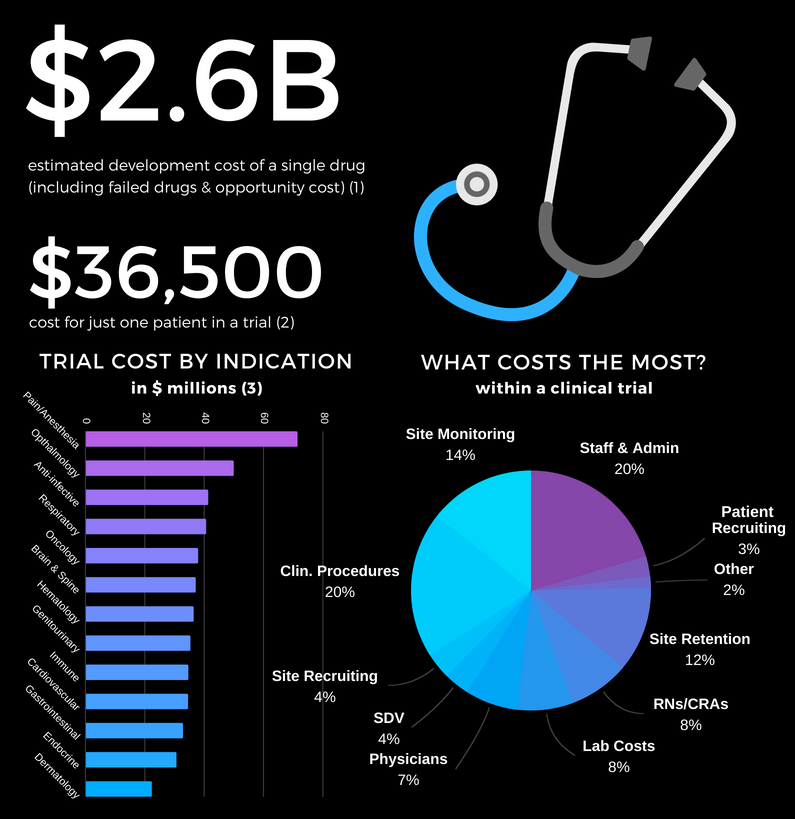

# ☠ Problems We Seek To Address

#### &#x20;The Cost of Clinical Research

* It costs [$2.6 billion](https://www.semanticscholar.org/paper/Innovation-in-the-pharmaceutical-industry%3A-New-of-DiMasi-Grabowski/3275f31c072ac11c6ca7a5260bd535720f07df41) to bring a drug to market (including failed attempts).
* The process takes over 10 years.
* It costs [$36k](https://www.clinicalleader.com/doc/getting-a-handle-on-clinical-trial-costs-0001) per subject in Phase III clinical trials.

 [source: clinicalresearch.io](https://www.clinicalresearch.io/blog/industry-trends/cost-of-clinical-trials-breakdown/)

This high cost leads to the following problems:


[no-data-on-unpatentable-molecules.md](../1-introduction-and-challenges/no-data-on-unpatentable-molecules.md)



[lack-of-incentive-to-discover-the-full-range-of-applications-for-off-patent-treatments.md](../1-introduction-and-challenges/lack-of-incentive-to-discover-the-full-range-of-applications-for-off-patent-treatments.md)



[no-long-term-outcome-data.md](../1-introduction-and-challenges/no-long-term-outcome-data.md)



[conflicts-of-interest.md](../1-introduction-and-challenges/conflicts-of-interest.md)


**Negative Results are Never Published**

Pharmaceutical companies that sponsor research often report only “positive” results, leaving out the non-findings or negative findings where a new drug or procedure may have proved more harmful than helpful. Selective publishing can prevent the rapid spread of beneficial treatments or interventions, but more commonly it means that bad news and failure of medical interventions go unpublished. Past analysis of clinical trials supporting new drugs approved by the FDA showed that just [43 percent of more than 900 trials on 90 new drugs](https://www.livescience.com/8365-dark-side-medical-research-widespread-bias-omissions.html) ended up being published. In other words, about 60 percent of the related studies remained unpublished even five years after the FDA had approved the drugs for market. That meant physicians were prescribing the drugs and patients were taking them without full knowledge of how well the treatments worked.

This leads to a massive waste of money by other companies repeating the same research and going down the same dead-end streets that could have been avoided.

### Trials Often Aren't Representative of Real Patients

External validity is the extent to which the results can be generalized to a population of interest. The population of interest is usually defined as the people the intervention is intended to help.

Phase III clinical trials are designed to exclude a vast majority of the population of interest. In other words, the subjects of the drug trials are not representative of the prescribed recipients, once said drugs are approved. One investigation found that only [14.5%](https://www.ncbi.nlm.nih.gov/pubmed/14628985) of patients with major depressive disorder fulfilled eligibility requirements for enrollment in an antidepressant efficacy trial.

As a result, the results of these trials are not necessarily generalizable to patients matching any of these criteria:

* Suffer from multiple mental health conditions (e.g., post-traumatic stress disorder, generalized anxiety disorder, bipolar disorder, etc.)
* Engage in drug or alcohol abuse
* Suffer from mild depression (Hamilton Rating Scale for Depression (HAM-D) score below the specified minimum)
* Use other psychotropic medications

These facts call into question the external validity of standard efficacy trials.

Furthermore, patient sample sizes are very small. The number of subjects per trial on average:

* [275](https://www.ncbi.nlm.nih.gov/books/NBK50886/) patients are sought per cardiovascular trial
* [20](https://www.ncbi.nlm.nih.gov/books/NBK50886/) patients per cancer trial
* [70](https://www.ncbi.nlm.nih.gov/books/NBK50886/) patients per depression trial
* [100](https://www.ncbi.nlm.nih.gov/books/NBK50886/) per diabetes trial

In the example in the graphic above, a drug is prescribed to millions of patients based on a study with only 36 subjects, where a representation of the general public is questionable.

### **Solution: Collect Data on Actual Patients**

In the real world, no patient can be excluded. Even people with a history of drug or alcohol abuse, people on multiple medications, and people with multiple conditions must be treated. Only through the crowdsourcing of this research, would physicians have access to the true effectiveness rates and risks for their real-world patients.

The results of crowdsourced studies would exhibit complete and utter external validity, since the test subjects are identical to the population of interest.

Furthermore, self-trackers represent a massive pool of potential subjects, dwarfing any traditional trial cohort. Diet tracking is the most arduous form of self-tracking. Yet, just one of the many available diet tracking apps, **MyFitnessPal,** has 30 million users.

Tracking any variable in isolation is nearly useless in that it cannot provide the causal which can be derived from combining data streams. Hence, this 30 million user cohort is a small fraction of the total possible [stratifiable](https://en.wikipedia.org/wiki/Stratified\_sampling) base.

This work is licensed under a [Creative Commons Attribution-NonCommercial-ShareAlike 4.0 International License](http://creativecommons.org/licenses/by-nc-sa/4.0/).
