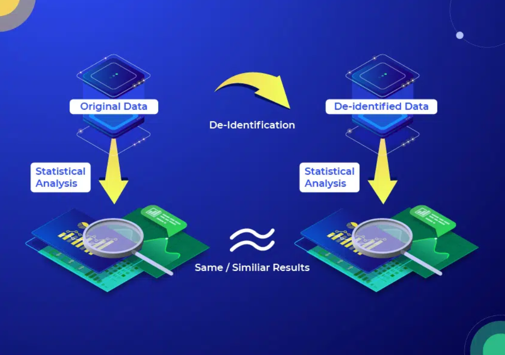

# 🥸 Privacy

👈 [Back to Table of Contents](../)

## Privacy

The Health Insurance Portability and Accountability Act of 1996 (“HIPAA”) protects the privacy of patients and sets forth guidelines on how this private health information can be shared. Though the privacy of a patient must be protected, the legal right of a business to sell health information of patients has been upheld by the Supreme Court of the United States.

## De-identification Methods

Data de-identification is the process of eliminating Personally Identifiable Data (PII) from any document or other media, including an individual’s Protected Health Information (PHI).

### Safe Harbor Method of De-identification

The HIPAA Safe Harbor Method is a precise standard for the de-identification of personal health information when disclosed for secondary purposes. It requires the removal of 18 identifiers from a dataset:

1. Names
2. All geographical subdivisions smaller than a State, including street address, city, county, precinct, zip code, and their equivalent geocodes, except for the initial three digits of a zip code, if according to the current publicly available data from the Bureau of the Census:
   1. The geographic unit formed by combining all zip codes with the same three initial digits contains more than 20,000 people and
   2. The initial three digits of a zip code for all such geographic units containing 20,000 or fewer people is changed to 000.
3. All elements of dates (except year) for dates directly related to an individual, including birth date, admission date, discharge date, date of death and all ages over 89 and all elements of dates (including year) indicative of such age, except that such ages and elements may be aggregated into a single category of age 90 or older
4. Phone numbers
5. Fax numbers
6. Electronic mail addresses
7. Social Security numbers
8. Medical record numbers
9. Health plan beneficiary numbers
10. Account numbers
11. Certificate/license numbers
12. Vehicle identifiers and serial numbers, including license plate numbers
13. Device identifiers and serial numbers
14. Web Universal Resource Locators (URLs)
15. Internet Protocol (IP) address numbers
16. Biometric identifiers, including finger and voice-prints
17. Full face photographic images and any comparable images and
18. Any other unique identifying number, characteristic, or code (note this does not mean the unique code assigned by the investigator to code the data).

### Data De-identification Tools

#### 1. ARX Data Anonymization Tool

[ARX](https://arx.deidentifier.org) is an open-source tool that anonymizes sensitive personal information. It supports a range of privacy and risk models, techniques for data transformation, and techniques to analyze the utility of output data.

#### 2. deid software package

The [deid software package](https://archive.physionet.org/physiotools/deid/) includes code and dictionaries that automatically locate and remove PHI in free text from medical records. It was developed using over 2,400 nursing notes that were methodically de-identified by a multi-pass process including various automated methods as well as reviews by multiple experts working autonomously.

#### 3. Synthetic Patient Generation

[Synthea](https://synthetichealth.github.io/synthea/) is an open-source, synthetic patient generator that models the medical history of synthetic patients. Our mission is to provide high-quality, synthetic, realistic but not real, patient data and associated health records covering every aspect of healthcare. The resulting data is free from cost, privacy, and security restrictions, enabling research with Health IT data that is otherwise legally or practically unavailable.

## References

1. [HealthVerity Census - HealthVerity](https://healthverity.com/solutions/healthverity-census/)
2. [Frontiers | A Policy and Practice Review of Consumer Protections and Their Application to Hospital-Sourced Data Aggregation and Analytics by Third-Party Companies | Big Data (frontiersin.org)](https://www.frontiersin.org/articles/10.3389/fdata.2020.603044/full)
3. [Data De-Identification, Data Minimization Into Snowflake with Baffle](https://baffle.io/blog/de-identifying-data-into-snowflake/)
4. [Use of Medicare Data (qemedicaredata.org)](https://www.qemedicaredata.org/apex/Use\_of\_Medicare\_Data)
5. [Data De-Identification - Satori (satoricyber.com)](https://satoricyber.com/data-masking/data-de-identification/)

#### [Next Privacy](10-ecosystem.md) 👉

This work is licensed under a [Creative Commons Attribution-NonCommercial-ShareAlike 4.0 International License](http://creativecommons.org/licenses/by-nc-sa/4.0/).
